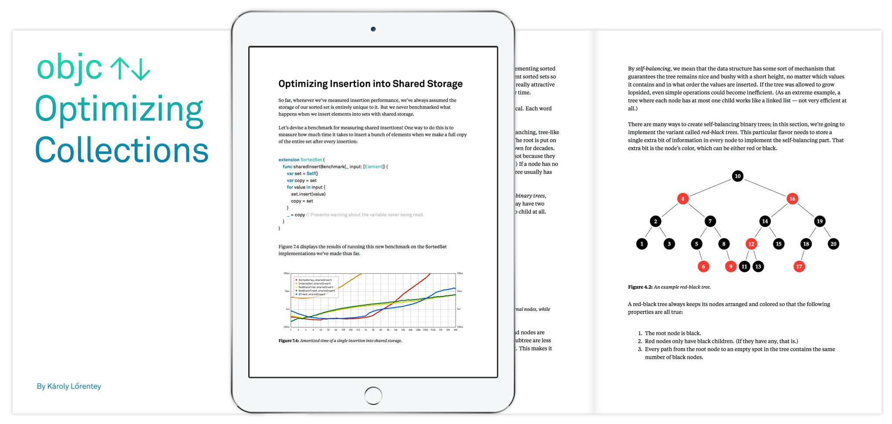

# Fast Sorted Collections for Swift Using In-Memory B-Trees

* [Overview](#overview)
* [Reference Documentation](#api)
* [Optimizing Collections: The Book](#book)
* [What Are B-Trees?](#what)
* [Why In-Memory B-Trees?](#why)
* [Laundry List of Issues with Standard Collection Types](#boo)
* [B-Trees to the Rescue!](#yay)
* [Implementation Notes](#notes)
* [Remark on Performance of Imported Generics](#generics)

### <a name="overview">Overview</a>

This project provides an efficient in-memory B-tree implementation in pure Swift, and several useful
sorted collection types that use B-trees for their underlying storage.

-   [`Map<Key, Value>`][Map] implements a sorted mapping from unique comparable keys to arbitrary values.
    It is like `Dictionary` in the standard library, but it does not require keys to be hashable, 
    it has strong guarantees on worst-case performance, and it maintains its elements in a well-defined
    order.

-   [`List<Element>`][List] implements a random-access collection of arbitrary elements. 
    It is like `Array` in the standard library, but lookup, insertion and removal of elements at
    any index have logarithmic complexity. 
    (`Array` has O(1) lookup, but insertion and removal at an arbitrary index costs O(n).)
    Concatenation of two lists of any size, inserting a list into another list at any position,
    removal of any subrange of elements, or extraction of an arbitrary sub-list are also
    operations with O(log(*n*)) complexity.

-   [`SortedSet<Element>`][SortedSet] implements a sorted collection of unique comparable elements.
    It is like `Set` in the standard library, but lookup, insertion and removal of any element
    has logarithmic complexity. Elements in an `SortedSet` are kept sorted in ascending order.
    Operations working on full sets (such as taking the union, intersection or difference) 
    can take as little as O(log(*n*)) time if the elements in the source sets aren't interleaved.

-   [`SortedBag<Element>`][SortedBag] implements a sorted [multiset][multiset] with
    comparable elements. This is a generalization of a set that allows multiple instances of the same value.
    (The standard library does not include such a collection, although you can use a dictionary to emulate one 
    by storing the multiplicities of the keys as values.)
    The implementation provided in this package stores each duplicate element separately, which may come useful
    if your elements are reference types with identities or you have some other means to distinguish between equal elements.
    `SortedBag` operations have the same time complexities as the equivalent operations in `SortedSet`.

-   [`BTree<Key, Value>`][BTree] is the underlying primitive collection that serves as base storage
    for all of the above collections. It is a general sorted key-value store with full support
    for elements with duplicate keys; it provides a sum of all operations individually provided
    by the higher-level abstractions above (and more!).

    The `BTree` type is public; you may want to use it if you need a collection flavor that 
    isn't provided by default (such as a multimap) 
    or if you need to use an operation that isn't exposed by the wrappers.
    
All of these collections are structs and they implement the same copy-on-write value semantics as
standard Swift collection types like `Array` and `Dictionary`. (In fact, copy-on-write works even
better with these than standard collections; continue reading to find out why!)

[Map]: http://attaswift.github.io/BTree/api/Structs/Map.html
[List]: http://attaswift.github.io/BTree/api/Structs/List.html
[SortedSet]: http://attaswift.github.io/BTree/api/Structs/SortedSet.html
[SortedBag]: http://attaswift.github.io/BTree/api/Structs/SortedBag.html
[multiset]: https://en.wikipedia.org/wiki/Set_(abstract_data_type)#Multiset

The latest version of `BTree` requires Swift 4. (The last release supporting Swift 3 was 4.0.2.)

### <a name="api">[Reference Documentation][doc]</a>

The project includes [a nicely formatted reference document][doc] generated from the documentation comments
embedded in its source code.

[doc]: http://attaswift.github.io/BTree/api

### <a name="book">[Optimizing Collections: The Book][OptimizingCollections]</a>

If you want to learn more about how this package works, the book
[Optimizing Collections][OptimizingCollections] includes detailed explanations of
many of the algorithms and optimization tricks implemented by this package – and so, so much more.
It is written by the same author, and published by the fine folks at objc.io.
Buying a copy of the book is not only a nice way to support this project, it also gets you something quite interesting to read.
Win-win!

[][OptimizingCollections]

[OptimizingCollections]: https://www.objc.io/books/optimizing-collections/

### <a name="what">What Are B-Trees?</a>

[B-trees][B-tree wiki] are search trees that provide a sorted key-value store with excellent performance
characteristics.  In essence, each node maintains a sorted array of its own elements, and
another array for its children.  The tree is kept balanced by three constraints: 

1. Only the root node is allowed to be less than half full.
2. No node may be larger than the maximum size.
3. The leaf nodes are all at the same level.

Compared to other popular search trees such as [red-black trees][red-black tree] or [AVL trees][avl wiki], 
B-trees have huge nodes: nodes often contain hundreds (or even thousands) of key-value pairs and children.

This module implements a "vanilla" B-tree where every node contains full key-value pairs. 
(The other popular type is the [B+-tree][b-plus tree] where only leaf nodes contain values; 
internal nodes contain only copies of keys.
This often makes more sense on an external storage device with a fixed block size, but it seems less useful for
an in-memory implementation.)

Each node in the tree also maintains the count of all elements under it. 
This makes the tree an [order statistic tree], where efficient positional lookup is possible.

[B-tree wiki]: https://en.wikipedia.org/wiki/B-tree
[red-black tree]: https://github.com/attaswift/RedBlackTree
[avl wiki]: https://en.wikipedia.org/wiki/AVL_tree
[order statistic tree]: https://en.wikipedia.org/wiki/Order_statistic_tree
[b-plus tree]: https://en.wikipedia.org/wiki/B%2B_tree

### <a name="why">Why In-Memory B-Trees?</a>

The Swift standard library offers heavily optimized arrays and hash tables, but omits linked lists and
tree-based data structures. This is a result of the Swift engineering team spending resources 
(effort, code size) on the abstractions that provide the biggest bang for the buck. 

> Indeed, the library lacks even a basic [double-ended queue][deque] construct -- 
> although Cocoa's `Foundation` framework does include one in `NSArray`.

[deque]: https://github.com/attaswift/Deque

However, some problems call for a wider variety of data structures. 

In the past, linked lists and low-order search trees such as red-black trees were frequently employed;
however, the performance of these constructs on modern hardware is greatly limited
by their heavy use of pointers.

[B-trees][B-tree wiki] were originally invented in the 1970s as a data structure for slow external storage
devices. As such, they are strongly optimized for locality of reference: 
they prefer to keep data in long contiguous buffers and they keep pointer derefencing to a minimum.
(Dereferencing a pointer in a B-tree usually meant reading another block of data from the spinning hard drive,
which is a glacially slow device compared to the main memory.)

Today's computers have multi-tiered memory architectures; they rely on caching to keep the system
performant. This means that locality of reference has become a hugely important property for in-memory
data structures, too.

Arrays are the epitome of reference locality, so the Swift stdlib's heavy emphasis on `Array` as the
universal collection type is well justified.

For example, using a single array to hold a sorted list of items has quite horrible (quadratic) asymptotic
complexity when there are many elements. However, up to a certain maximum size, a simple array is in fact 
the most efficient way to represent a sorted list.

The benchmark above demonstrates this really well: insertion of *n* elements into a sorted array 
costs O(n^2) when there are many items, but for many reasonably sized data sets, it is still much faster 
than creating a red-black tree with its fancypants O(n * log(n)) complexity. 

Near the beginning of the curve, up to about *eighteen thousand items*, a sorted array implementation
imported from an external module is very consistently about 6-7 times faster than a red-black tree, with a
slope that is indistinguishable from O(n * log(n)).

Even after it catches up to quadratic complexity, in this particular benchmark, 
it takes about a *hundred thousand items* for the sorted
array to become slower than the red-black tree! 

> The exact cutoff point depends on the type/size of elements that you work with, and the capabilities 
> of the compiler. This benchmark used tiny 8-byte integer elements, hence the huge number.

> The benchmark is based on [my own red-black tree implementation][red-black tree] that uses a single flat array to store
> node data. A [more typical implementation][airspeed-velocity] would store each node in a separately allocated object, so
> it would likely be even slower.

[airspeed-velocity]: http://airspeedvelocity.net/2015/07/22/a-persistent-tree-using-indirect-enums-in-swift/

> The chart above is a [log-log plot][loglog] which makes it easy to compare the polynomial exponents of 
> the complexity curves of competing algorithms at a glance. The slope of a quadratic algorithm on a log-log chart
> (like insertion into a sorted array---the green curves) is twice of that of a 
> linear algorithm (like appending *n* items to an unsorted array---light blue curve) or a quasilinear one 
> (like inserting into a red-black tree, red curve).

[loglog]: https://en.wikipedia.org/wiki/Log–log_plot

> Note that the big gap between collections imported from
> stdlib and those imported from external modules is caused by a [limitation in the current Swift compiler/ABI](#perf):
> when this limitation is lifted, the gap will narrow considerably, which will reduce the element count
> at which you'll be able to reap the benefits of lower asymptotic complexity.

> (This effect is already visible (albeit in reverse) on the benchmark for the "inlined" sorted array (light green), 
> which is essentially the same code as the regular one (dark green) except it was implemented
> in the same module as the benchmarking loop, so the compiler has more options to optimize away
> witness tables and other levels of abstraction. That line starts curving up much sooner, at about 2000 
> items--imagine having a B-tree implementation that's equally fast! Or better, try it yourself and report your
> results. Producing benchmarks like this takes a lot of time and effort.) :-)

This remarkable result is due in large part to the vast number of (to a CPU, random-looking) memory 
references that are needed to operate on red-black trees. 
Their [intricate ballet of tree rotations][rbtree-animation] looks mighty impressive 
to us mere humans, but to the delicate caches of your poor CPU, 
it looks more like a drunken elephant [moshing at a thrash metal concert][moshing].

[rbtree-animation]: https://youtu.be/m9tse9Gr2pE?t=209
[moshing]: https://en.wikipedia.org/wiki/Moshing

Meanwhile, the humble `Array` does the only thing it knows: sliding around
long contiguous memory regions. It does this over and over, ad nauseum. It doesn't look impressive,
but (up to a point) it fits well with how computers work.

So a small `Array` is perfect for maintaining a sorted list. But what if the list gets too long?
The B-tree's answer is to simply cut the array in half, and to create a new index tree node on top to allow 
it to quickly find its way around this more complex list structure. 
These internal index nodes can also consist of arrays of elements and node references, 
creating a nice recursive data structure.

Because their fanout number is so high, B-trees are extremely shallow: for a B-tree with order 100 (which
is actually rather on the low end), you can fit a billion items into a tree that's not more than five levels deep.

Once you accept that small arrays are fast, it is easy to see why B-trees work so well: unless it holds more
elements than its order, a B-tree quite literally **is** just an `Array`. 
So it has the same performance behavior as an `Array` for a small number of elements, 
and when it grows larger it prevents a quadratic upswing by never allowing its arrays to get too large.
The yellow curve on the benchmark above demonstrates this behavior well.

Consider that each node in a typical B-tree can hold about *ten full levels of a red-black tree* 
(or AVL trees or whatever binary tree you like). 
Looking up an item in a B-tree node still requires a binary search of the node
array, but this search works on a contiguous memory region, while the conventional search tree
is fiddling around with loading pointer values and dereferencing them.

So it makes perfect sense to employ B-trees as an in-memory data structure.

Think about this, though: how many times do you need to work with a hundred thousand
sorted items in a typical app? Or even twenty thousand? Or even just two thousand? The most interesting
benefits of B-trees often occur at element counts well over a hundred thousand.
However, B-trees are not much slower than arrays for low element counts (remember, they *are* arrays in that
case), so it makes sense to use them when there's even a slight chance that the count will get large.

### <a name="boo">Laundry List of Issues with Standard Collection Types</a>

The data structures implemented by `Array`, `Dictionary` and `Set` are remarkably versatile:
a huge class of problems is easily and efficiently solved by simple combinations of these abstractions.
However, they aren't without drawbacks: you have probably run into cases when the standard collections
exhibit suboptimal behavior:

1.  Insertion and removal in the middle of an `Array` can be slow when there are many items. (Keep the previous section in mind, though.)

2.  The all-or-nothing [copy-on-write behavior][cow] of `Array`, `Dictionary` and `Set` can lead to performance problems
    that are hard to detect and fix.
    If the underlying storage buffer is being shared by multiple collection instances, the modification of a single element 
    in any of the instances requires creating a full copy of every element. 
    
    It is not at all obvious from the code when this happens, and it is even harder to reliably check for. 
    You can't (easily) write unit tests to check against accidental copying of items with value semantics!

3.  With standard collection types, you often need to think about memory management.

    Arrays and dictionaries never release memory until they're entirely deallocated; 
    a long-lived collection may hold onto a large piece of memory due to an earlier, temporary spike in the 
    number of its elements. This is a form of subtle resource leak that can be hard to detect.
    On memory-constrained systems, wasting too much space may cause abrupt process termination.

    Appending a new element to an array, or inserting a new element into a dictionary or a set are 
    usually constant time operations, but they sometimes take O(*n*) time when the collection exhausts its allocated capacity.
    These spikes in execution time are often undesired, but preventing them requires careful size analysis.  
    If you reserve too little space, you'll still get spikes; if you reserve too much, you're wasting memory.
    
4.  The order of elements in a `Dictionary` or a `Set` is undefined, and it isn't even stable:
    it may change after seemingly simple mutations. Two collections with the exact same set of elements may store
    them in wildly different order.

5.  Hashing collections require their keys to be `Hashable`. If you want to use your own type as the key, 
    you need to write a hash function yourself. It is annoyingly hard to write a good hash function, and 
    it is even harder to test that it doesn't produce too many collisions for the sets of values your code 
    will typically use.

6.  The possibility of hash collisions make `Dictionary` and `Set` badly suited for tasks which require
    guaranteed worst-case performance. (E.g. server code may face low-bandwidth denial of service attacks due to
    [artificial hash collisions][hash dos].)

7.  Array concatenation takes O(*n*) time, because it needs to put a copy of every element from both arrays 
    into a new contiguous buffer.

8.  Merging dictionaries or taking the union/intersection etc. of two sets are all costly
    O(*n*) operations, even if the elements aren't interleaved at all.

9.  Creating an independently editable sub-dictionary or subset requires elementwise iteration over either
    the entire collection, or the entire set of potential target items. This is often impractical, especially
    when the collection is large but sparse.
    
    Getting an independently editable sub-array out of an array takes time that is linear in the size of the result. 
    (`ArraySlice` is often helpful, but it is most effective as a short-lived read-only view in temporary local variables.)

These issues don't always matter. In fact, lots of interesting problems can be solved without 
running into any of them. When they do occur, the problems they cause are often insignificant.
Even when they cause significant problems, it is usually straightforward to work around them by chosing a
slightly different algorithm. 

But sometimes you run into a case where the standard collection types are too slow, 
and it would be too painful to work around them.
    
[hash dos]: http://arstechnica.com/business/2011/12/huge-portions-of-web-vulnerable-to-hashing-denial-of-service-attack/
[cow]: https://en.wikipedia.org/wiki/Copy-on-write

### <a name="yay">B-Trees to the Rescue!</a>

B-trees solve all of the issues above. 
(Of course, they come with a set of different issues of their own. Life is hard.)

Let's enumerate:

1.  Insertion or removal from any position in a B-tree-based data structure takes O(log(*n*)) time, no matter what.

2.  Like standard collection types, B-trees implement full copy-on-write value semantics.
    Copying a B-tree into another variable takes O(1) time; mutations of a copy do not affect the original instance.
    
    However, B-trees implement a greatly improved version of copy-on-write that is not all-or-nothing: 
    each node in the tree may be independently shared with other trees. 
    
    If you need to insert/remove/update a single element, B-trees will copy at most O(log(*n*)) elements to satisfy
    value semantics, even if the tree was entirely shared before the mutation.

3.  Storage management in B-trees is granular; you do not need to reserve space for a B-tree in advance, and
    it never allocates more memory than it needs to store the actual number of elements it contains.
    
    Storage is gradually allocated and released in small increments as the tree grows and shrinks.
    Storage is only copied when mutating shared elements, and even then it is done in small batches.
    
    The performance of B-trees is extremely stable, with no irregular spikes ever.
    
    (Note that there is a bit of leeway in allocations to make it easy to balance the tree. 
    In the worst case, a B-tree may only fill 50% of the space it allocates. The ratio is typically 
    much higher than that, though.)

4.  B-trees always keep their items sorted in ascending key order, and they provide efficient positional lookups.
    You can get the *i*th smallest/largest item in a tree in O(log(*n*)) time.

5.  Keys of a B-tree need to be `Comparable`, not `Hashable`. It is often significantly easier to 
    write comparison operators than hash functions; it is also much easier to verify that the implementation works 
    correctly. A buggy `<` operator will typically lead to obvious issues that are relatively easy to catch; 
    a badly collisioning hash may go undetected for years.

6.  Adversaries (or blind chance) will never produce a set of elements for which B-trees behave especially badly.
    The performance of B-trees only depends on the size of the tree, not its contents. 
    (Provided that key comparison also behaves uniformly, of course. 
    If you allow multi-megabyte strings as keys, you're gonna have a bad time.)

7.  Concatenation of any two B-trees takes O(log(*n*)) time. For trees that aren't of a trivial size, the result 
    will share some of its nodes with the input trees, deferring most copying until the time the tree needs to be modified.
    (Which may never happen.) Copy-on-write really shines with B-trees!
    
8.  Merging the contents of two B-trees into a single tree takes O(*n*) time in the worst case, but
    if the elements aren't too badly interleaved, it can often finish in O(log(*n*)) time by linking entire subtrees
    into the result in one go.
    
    Set operations on the keys of a B-tree (such as calculating the intersection set, subtraction set, 
    symmetric difference, etc.) also exploit the same trick for a huge performance boost.
    If the input trees are mutated versions of the same original tree, these operations are also able 
    to skip elementwise processing of entire subtrees that are shared between the inputs.

9.  The `SubSequence` of a B-tree is also a B-tree. You can slice and dice B-trees any way you like:
    getting a fully independent copy of any prefix, suffix or subrange in a tree only takes O(log(*n*)) time.
    You can then take the subtree you extracted and insert it into another tree; this also costs O(log(*n*)), 
    no matter where in the tree you want to put it. (You do need to keep the order of keys correct, though.)

### <a name="notes">Implementation Notes</a>

-   [`BTree`][BTree] is a generic struct with copy-on-write value semantics.  Internally, it stores its data in
    nodes with a fixed maximum size, arranged in a tree.  `BTree` type provides a full set of hand-tuned 
    high-level operations to work with elements of a B-tree.
    
    Nodes are represented by instances of a [reference type][BTreeNode] that is not exported as public API.
    (Low-level access to individual tree nodes would be tricky to get right, and it would prevent
    future optimizations, such as moving node counts up to parent nodes.)

-   By default, the tree order (a.k.a., the fanout, or the maximum number of children) is set such
    that [each node stores about 16KiB data][bTreeNodeSize]. Larger node sizes make lookups faster, while
    insertion/removal becomes slower -- 16KiB is a good enough approximation of the optimal node size
    on most modern systems.  (But you can also set a custom node size if you know better. Note though
    that you cannot mix-n-match trees of different orders.)  Thus, on a 64-bit system, a B-tree
    holding `Int` elements will store about 2047 elements per node. Wow!

[bTreeNodeSize]: https://github.com/attaswift/BTree/blob/master/Sources/BTreeNode.swift#L23

-   Individual B-tree nodes may be independently shared between multiple B-trees.  When mutating a
    (partially or fully) shared tree, copy-on-write is restricted to only clone the nodes whose subtree is
    actually affected by the mutation. This has the following consequences:
  
    - Nodes cannot contain a reference to their parent node, because it is not necessarily unique. 
    
    - Mutations of shared trees are typically much cheaper than copying the entire collection at once, 
      which is what standard collection types do.
      
    - The root node is never shared between trees that are not equal.

-   [`BTree`][BTree] allows elements with duplicate keys to be stored in the tree. 
    (In fact, `List` works by using the same (empty) key for all elements.) 

    All methods that take a key to find an element [let you (optionally) specify][BTreeKeySelector] if you
    want to work with the first or last matching element, or if you're happy with any match. The latter
    option is sometimes faster as it often allows the search to stop at the topmost matching element. There
    is also a selector that looks for the element *after* the specified key -- this can be nice to determine
    the position of the end of a range of matching items.

-   Each node keeps track of the number of items in its entire subtree, so 
    [efficient positional lookup][BTree.elementAtOffset]
    is possible.  For any *i*, you can get, set, remove or insert the *i*th item in the tree in log(n) time.

-   There is a [`BTreeIterator`][BTreeIterator] and a [`BTreeIndex`][BTreeIndex] that provide the
    usual generator/indexing semantics. While individual element lookup usually takes O(log(n))
    operations, iterating over all elements via these interfaces requires linear time. Using the
    generator is faster than indexing, so you should prefer using it whenever possible. 
    There are methods to start an iterator from the middle of the tree: 
    from any offset, any index, or any key.
    
-   Note that [`forEach`][BTree.forEach] has a specialized recursive implementation, 
    which makes it the fastest way to iterate over B-trees. There is even a variant that allows you
    to stop the iteration when you had seen enough items and want to get off the carousel.

-   [`BTreeCursor`][BTreeCursor] is an easy-to-use, general-purpose batch editing facility that allows you to
    manipulate the elements of a B-tree conveniently and highly efficiently. You can use a cursor to
    walk over the contents of a tree, modifying/inserting/removing elements as needed without a
    per-element log(n) lookup overhead. If you need to insert or remove a bunch or consecutive elements,
    it is better to use the provided bulk removal/insertion methods than to process them individually 
    (Range operations have O(log(*n*)) complexity vs. elementwise processing takes O(*k* * log(n)).)
    
-   Internally, navigation in a B-Tree is based on abstract primitives that maintain a path to a particular
    position in the tree, as described by the [`BTreePath`][BTreePath] protocol. The methods directly
    provided by this protocol are too low-level for convenient use, but the protocol has extension methods
    built on top of these that support familiar concepts like moving back and forth step by step, jumping to
    a specific offset in the tree, or looking up a particular key.
    
    Indexes, generators and cursors use their particular implementation of `BTreePath` to represent their
    own path flavors. All three of them maintain a path of nodes from the root of the tree to a particular
    slot of a particular node, but the details are very different:
    
    - A [`BTreeIndex`][BTreeIndex] may not hold a strong reference to its tree, because that would 
      interfere with copy-on-write when you want to mutate the tree at a certain index. Thus, indices
      are wrappers around a [`BTreeWeakPath`][BTreeWeakPath], which uses weak references, and 
      needs to tread very carefully in order to detect when one of its references gets out of date.
      
    - Meanwhile a [`BTreeIterator`][BTreeIterator] is supposed to support standalone iteration over the
      contents of the tree, so it must contain strong references. It uses a
      [`BTreeStrongPath`][BTreeStrongPath] to represent the path of its next element. While an iterator only
      needs to be able to move one step forward, `BTreeStrongPath` supports the full tree navigation API,
      making it very useful elsewhere in the codebase whenever we need a kind of read-only cursor into a
      tree. For example, the tree merging algorithm uses strong paths to represent its current positions in
      its input trees.
      
    - Finally, a [`BTreeCursor`][BTreeCursor] needs to maintain a path where each node is uniquely
      held by the cursor, ready for mutation. (A cursor owns its own copy of the tree, and does
      not share it with the outside world until it is finished.) 
      This special path flavor is implemented by [`BTreeCursorPath`][BTreeCursorPath].
      To speed things up, this struct intentionally breaks the node counts on its current path, 
      to allow for super speedy elementwise insertions and removals. The counts are carefully recalculated
      whenever the path moves off a node's branch in the tree.
          
[BTreePath]: https://github.com/attaswift/BTree/blob/master/Sources/BTreePath.swift
[BTreeWeakPath]: https://github.com/attaswift/BTree/blob/master/Sources/BTreeIndex.swift#L87
[BTreeStrongPath]: https://github.com/attaswift/BTree/blob/master/Sources/BTreeIterator.swift#L74
[BTreeCursorPath]: https://github.com/attaswift/BTree/blob/master/Sources/BTreeCursor.swift#L96

-   It would be overkill to create an explicit path to look up or modify a single element in the tree
    on its own, so `BTree` also provides a [set of recursive methods][BTree-lookups] that 
    implement the same sort of lookups and simple mutations. 
    They are faster when you need to retrieve a single item, but they aren't efficient when called repeatedly.
    
[BTree-lookups]: https://github.com/attaswift/BTree/blob/master/Sources/BTree.swift#L280-L419

-   `BTree` includes a [bulk loading algorithm][BTree.bulkLoad] that efficiently initializes fully loaded
    trees from any sorted sequence. You can also specify a fill factor that's less than 100% if you expect to
    insert data into the middle of the tree later; leaving some space available may reduce work to keep the
    tree balanced. The bulk loader can optionally filter out duplicate keys for you. It verifies that the
    elements are in the correct order and traps if they aren't.
    
    The bulk loader is based on a general [`BTreeBuilder`][BTreeBuilder] struct that specializes on
    appending elements to a newly created tree. Beside individual elements, it also supports efficiently 
    appending entire B-trees. This comes useful in optimized tree merging algorithms.

[BTree.bulkLoad]: http://attaswift.github.io/BTree/api/Structs/BTree.html#/s:FV5BTree5BTreecuRd__s8SequenceWd__8Iterator7Element_zTxq__rFT14sortedElementsqd__14dropDuplicatesSb5orderSi10fillFactorSd_GS0_xq__
[BTreeBuilder]: https://github.com/attaswift/BTree/blob/master/Sources/BTreeBuilder.swift
    
-   [Constructing a B-tree from an unsorted sequence of elements][BTree.unsorted-load] inserts the elements into the tree one by
    one; no buffer is allocated to sort elements before loading them into the tree. This is done more
    efficiently than calling [an insertion method][BTree.insert] with each element one by one, but it is likely still slower than
    a quicksort. (So sort elements on your own if you can spare the extra memory.)

[BTree.insert]: http://attaswift.github.io/BTree/api/Structs/BTree.html#/Insertion
[BTree.unsorted-load]: http://attaswift.github.io/BTree/api/Structs/BTree.html#/s:FV5BTree5BTreecuRd__s8SequenceWd__8Iterator7Element_zTxq__rFTqd__14dropDuplicatesSb5orderSi_GS0_xq__

-   The package contains O(log(n)) methods to [extract a range of elements as a new B-tree][BTree.subtree]
    and to [insert a B-tree into another B-tree][BTreeCursor.insertTree]. (Keys need to remain sorted
    correctly, though.)
    
-   Merge operations (such as [`BTree.union`][BTree.union] and [`BTree.symmetricDifference`)][BTree.symmetricDifference]
    are highly tuned to detect when they can skip over entire subtrees on their input, linking them into the result or 
    skipping their contents as required. For input trees that contain long runs of distinct elements, these operations
    can finish in as little as O(log(*n*)) time. These algorithms are expressed on top of a general
    tree merging construct called [`BTreeMerger`][BTreeMerger].

[BTree]: http://attaswift.github.io/BTree/api/Structs/BTree.html
[BTreeNode]: https://github.com/attaswift/BTree/blob/master/Sources/BTreeNode.swift
[BTreeKeySelector]: http://attaswift.github.io/BTree/api/Enums/BTreeKeySelector.html
[BTreeIterator]: http://attaswift.github.io/BTree/api/Structs/BTreeIterator.html
[BTreeIndex]: http://attaswift.github.io/BTree/api/Structs/BTreeIndex.html
[BTreeCursor]: http://attaswift.github.io/BTree/api/Classes/BTreeCursor.html
[BTree.elementAtOffset]: http://attaswift.github.io/BTree/api/Structs/BTree.html#/s:FV5BTree5BTree7elementFT8atOffsetSi_Txq__
[BTree.forEach]: http://attaswift.github.io/BTree/api/Structs/BTree.html#/s:FV5BTree5BTree7forEachFzFzTxq__T_T_
[BTreeCursor.insertTree]: http://attaswift.github.io/BTree/api/Classes/BTreeCursor.html#/s:FC5BTree11BTreeCursor6insertFGVS_5BTreexq__T_
[BTree.subtree]: http://attaswift.github.io/BTree/api/Structs/BTree.html#/s:FV5BTree5BTree7subtreeFT4fromx2tox_GS0_xq__
[BTree.union]: http://attaswift.github.io/BTree/api/Structs/BTree.html#/s:FV5BTree5BTree5unionFTGS0_xq__2byOS_21BTreeMatchingStrategy_GS0_xq__
[BTree.symmetricDifference]: http://attaswift.github.io/BTree/api/Structs/BTree.html#/s:FV5BTree5BTree19symmetricDifferenceFTGS0_xq__2byOS_21BTreeMatchingStrategy_GS0_xq__
[BTreeMerger]: https://github.com/attaswift/BTree/blob/master/Sources/BTreeMerger.swift#L318

### <a name="generics">Remark on Performance of Imported Generics</a>

Current versions of the Swift compiler are unable to specialize generic types that are imported from 
external modules other than the standard library. (In fact, it is not entirely incorrect to say that 
the standard library works as if it was compiled each time anew as part of every Swift module rather than linked in 
as an opaque external binary.)

This limitation puts a considerable limit on the raw performance achievable by collection types imported
from external modules, especially if they are parameterized with simple, extremely optimizable 
value types such as `Int` or even `String`.
Relying on `import` will incur a *10-200x slowdown* when your collection is holding these most basic 
value types. (The effect is much reduced for reference types, though.)

Without access to the full source code of the collection, the compiler is unable to optimize away abstractions
like virtual dispatch tables, function calls and the rest of the *fluff* we've learned to mostly ignore
inside a module. In cross-module generics, even retrieving a single `Int` will necessarily go through 
at least one lookup to a virtual table. This is because the code that implements the unspecialized generic also executes 
for type parameters that contain reference types, whose reference count needs to be maintained.

If raw performance is essential, currently the only way out of this pit is to put the collection's code inside 
your module. (Other than hacking stdlib to include these extra types, of course -- but that is a bad idea
for a thousand obvious reasons.) However, having each module maintain its own set of collections would smell 
horrible, plus it would make it hard or impossible to transfer collection instances across module boundaries.
Plus, if this strategy would be used across many modules, it would lead to a C++ templates-style (or worse) code explosion.
A better (but still rather unsatisfactory) workaround is to compile the collection code with the single module 
that benefits most from specialization. The rest of the modules will still have access to it, if in a much slower way.

The Swift compiler team has plans to address this issue in future compiler versions, e.g., by allowing library authors 
to manually specialize generics for a predetermined set of type parameters.
